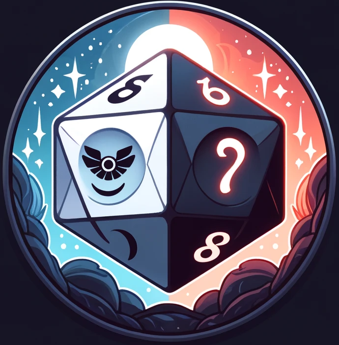

# Duality Discord Bot



Duality is a Discord bot designed to help you and your friends play Daggerheart online. Inspired by the game's mechanic where two 12-sided dice are rolled for each action, one for hope and one for fear, Duality facilitates game management and dice rolls directly from Discord.

## Features

- **Advanced Dice Roller**: Uses the `d20` library for advanced dice rolls.
- **Action Rolls**: Ability to roll actions with hope and fear dice.
- **Demiplane Integration**: Import character sheets from Demiplane.
- **Attribute-Based Rolls**: Perform action rolls based on character attributes.

## Requirements

- Python 3.8+
- Redis Server 7+
- PostgreSQL DB 16.3
- Chrome WebDriver

## Installation

1. Clone this repository:

    ```bash
    git clone https://github.com/your-username/duality-bot.git
    cd duality-bot
    ```

2. Create a virtual environment and activate it:

    ```bash
    python3 -m venv venv
    source venv/bin/activate  # On Windows use `venv\Scripts\activate`
    ```

3. Install the dependencies:

    ```bash
    pip install -r requirements.txt
    ```

4. Set up environment variables:

    Create a `.env` file in the root of the project and add the following variables:

    ```env
    DISCORD_TOKEN=your_discord_token
    REDIS_TLS_URL=your_redis_url
    DATABASE_URL=your_postgresql_database_url
    GOOGLE_CHROME_BIN=path_to_google_chrome_bin
    CHROMEDRIVER_PATH=path_to_chromedriver
    ```

    To obtain the Discord token, follow these steps:

    1. Go to the [Discord Developer Portal](https://discord.com/developers/applications).
    2. Create a new application.
    3. Go to the "Bot" tab and add a bot to your application.
    4. Copy the bot token and paste it into the `.env` file.

5. Run the bot:

    ```bash
    python bot.py
    ```

## Usage

### Basic Commands

- `!ping`: Check if the bot is active.
- `!import <demiplane_sheet_url>`: Import a character sheet from Demiplane.
- `!roll <dice_expr>`: Roll the dice according to the given expression (e.g., `!roll 2d6+3`).
- `!action [<modifier_dice_expr>]`: Perform an action roll with hope and fear dice.
- `!show`: Display the current character sheet.
- `!agility`: Perform an agility roll.
- `!hp <dice_expr>`: Update hit points based on the given dice expression.

## Contributing

Contributions are welcome. Please follow these steps to contribute:

1. Fork the repository.
2. Create a branch for your feature (`git checkout -b feature/new-feature`).
3. Make your changes and commit them (`git commit -am 'Add new feature'`).
4. Push your branch (`git push origin feature/new-feature`).
5. Open a Pull Request.

### Project Architecture

The project follows a simplified clean architecture with the following folders:

- **adapter**: Implementation specific to the infrastructure.
  - **controllers**: Contains the bot commands (cog).
  - **gateways**: Contains the interaction with the Redis cache and the PostgreSQL database.
  - **presenters**: Contains the formatting of messages returned by the bot.
- **domain**: Application domain classes.
  - **entities**: Basic bot classes.
  - **interactors**: Bot use cases, corresponding almost 1:1 with the commands in the controllers.
  - **interfaces**: Contracts that the gateways must fulfill.
- **test**: Contains the tests using pytest.

## License

This project is licensed under the GPL-3.0 License. See the [LICENSE](LICENSE) file for details.

## Acknowledgements

- Thanks to the Avrae project for inspiring this bot.
